# 五加一 5+1

**世界不死，理想不灭。**
*The world endures, and ideals never fade.*

河海大学计算机在读 · 中国江苏
CS undergrad at Hohai University · Jiangsu, China

[主页 Home](https://r-l.ink/home) · [博客 Blog](http://r-l.ink/blog) · [关于 About](https://r-l.ink/about) · [邮件 Mail](http://r-l.ink/mail)

---

## Featured

<a href="https://github.com/five-plus-one/AI-Marker-Suite">
  <picture>
    <source srcset="./profile/pinned-AI-Marker-Suite_dark.svg" media="(prefers-color-scheme: dark)" />
    <source srcset="./profile/pinned-AI-Marker-Suite_light.svg" media="(prefers-color-scheme: light), (prefers-color-scheme: no-preference)" />
    
  </picture>
</a>

AI 阅卷自动批改助手 — 支持智学网、七天网络、好分数、五岳阅卷、华翰云、光大阅卷等平台。自动识别手写答案、智能评分、自动填分提交。支持普通 / 试改 / 无人值守三种模式，分小题评分，分数纠错自动优化提示词，评阅历史导出。挂机睡觉，醒来改完。

*AI-powered exam grading assistant for major Chinese e-marking platforms — handwriting recognition, per-question scoring, auto-submit, unattended overnight runs.*

[文档 Docs](https://github.com/five-plus-one/AI-Marker-Suite-Docs) · `JavaScript` `AI` `Automation`

---

## Stats

<picture>
  <source srcset="./profile/stats_dark.svg" media="(prefers-color-scheme: dark)" />
  <source srcset="./profile/stats_light.svg" media="(prefers-color-scheme: light), (prefers-color-scheme: no-preference)" />
  
</picture>
<picture>
  <source srcset="./profile/top-langs_dark.svg" media="(prefers-color-scheme: dark)" />
  <source srcset="./profile/top-langs_light.svg" media="(prefers-color-scheme: light), (prefers-color-scheme: no-preference)" />
  
</picture>

---

## Projects

<table>
  <tr>
    <td width="50%" align="center" valign="top">
      <a href="https://github.com/five-plus-one/GravityLink">
        <picture>
          <source srcset="./profile/pinned-GravityLink_dark.svg" media="(prefers-color-scheme: dark)" />
          <source srcset="./profile/pinned-GravityLink_light.svg" media="(prefers-color-scheme: light), (prefers-color-scheme: no-preference)" />
          
        </picture>
      </a>
       
      私有化短链与活码系统 · <em>Short-link platform</em>
    </td>
    <td width="50%" align="center" valign="top">
      <a href="https://github.com/five-plus-one/SimpleHomepage">
        <picture>
          <source srcset="./profile/pinned-SimpleHomepage_dark.svg" media="(prefers-color-scheme: dark)" />
          <source srcset="./profile/pinned-SimpleHomepage_light.svg" media="(prefers-color-scheme: light), (prefers-color-scheme: no-preference)" />
          
        </picture>
      </a>
       
      极简静态主页生成器 · <em>Minimal homepage</em>
    </td>
  </tr>
  <tr>
    <td width="50%" align="center" valign="top">
      <a href="https://github.com/five-plus-one/HoHai110_frontend">
        <picture>
          <source srcset="./profile/pinned-HoHai110-frontend_dark.svg" media="(prefers-color-scheme: dark)" />
          <source srcset="./profile/pinned-HoHai110-frontend_light.svg" media="(prefers-color-scheme: light), (prefers-color-scheme: no-preference)" />
          
        </picture>
      </a>
       
      河海 110 周年校庆网站 · <em>Anniversary site</em>
    </td>
    <td width="50%" align="center" valign="top">
      <a href="https://github.com/five-plus-one/HoHai110_backend">
        <picture>
          <source srcset="./profile/pinned-HoHai110-backend_dark.svg" media="(prefers-color-scheme: dark)" />
          <source srcset="./profile/pinned-HoHai110-backend_light.svg" media="(prefers-color-scheme: light), (prefers-color-scheme: no-preference)" />
          
        </picture>
      </a>
       
      校庆网站后端 API · <em>Backend API</em>
    </td>
  </tr>
  <tr>
    <td width="50%" align="center" valign="top">
      <a href="https://github.com/five-plus-one/ZhiXueMatrix">
        <picture>
          <source srcset="./profile/pinned-ZhiXueMatrix_dark.svg" media="(prefers-color-scheme: dark)" />
          <source srcset="./profile/pinned-ZhiXueMatrix_light.svg" media="(prefers-color-scheme: light), (prefers-color-scheme: no-preference)" />
          
        </picture>
      </a>
       
      中国软件杯 A3 · <em>Software Cup entry</em>
    </td>
    <td width="50%" align="center" valign="top">
      <a href="https://github.com/five-plus-one/EduAgent">
        <picture>
          <source srcset="./profile/pinned-EduAgent_dark.svg" media="(prefers-color-scheme: dark)" />
          <source srcset="./profile/pinned-EduAgent_light.svg" media="(prefers-color-scheme: light), (prefers-color-scheme: no-preference)" />
          
        </picture>
      </a>
       
      服务外包大赛 · 东部赛区二等奖 · <em>2nd prize</em>
    </td>
  </tr>
  <tr>
    <td width="50%" align="center" valign="top">
      <a href="https://github.com/five-plus-one/Cardan">
        <picture>
          <source srcset="./profile/pinned-Cardan_dark.svg" media="(prefers-color-scheme: dark)" />
          <source srcset="./profile/pinned-Cardan_light.svg" media="(prefers-color-scheme: light), (prefers-color-scheme: no-preference)" />
          
        </picture>
      </a>
       
      卡尔丹圆运动学可视化 · <em>Kinematics viz</em>
    </td>
    <td width="50%" align="center" valign="top">
      <a href="https://github.com/five-plus-one/Pyrojewel">
        <picture>
          <source srcset="./profile/pinned-Pyrojewel_dark.svg" media="(prefers-color-scheme: dark)" />
          <source srcset="./profile/pinned-Pyrojewel_light.svg" media="(prefers-color-scheme: light), (prefers-color-scheme: no-preference)" />
          
        </picture>
      </a>
       
      有些话写成了代码 · <em>Some words become code</em>
    </td>
  </tr>
</table>

---

If you find my projects helpful, feel free to [buy me a coffee](https://r-l.ink/support) ☕

