## Hi there, I'm 5+1 👋

### About Me

- 🎓 Computer Science student at Hohai University
- 💻 Passionate about programming and technology exploration
- 🌱 Continuously learning...

### Find Me Online

- 🏠 Homepage: [https://r-l.ink/home](https://r-l.ink/home)
- 📝 Blog: [http://r-l.ink/blog](http://r-l.ink/blog)
- 💬 Contact: [https://r-l.ink/about](https://r-l.ink/about)
- 📫 Email: [5plus1@five-plus-one.com](http://r-l.ink/mail)

### Support Me

If you find my projects helpful, feel free to buy me a coffee ☕

---

<picture>
  <source srcset="./profile/stats_dark.svg" media="(prefers-color-scheme: dark)" />
  <source srcset="./profile/stats_light.svg" media="(prefers-color-scheme: light), (prefers-color-scheme: no-preference)" />
  
</picture>

<picture>
  <source srcset="./profile/top-langs_dark.svg" media="(prefers-color-scheme: dark)" />
  <source srcset="./profile/top-langs_light.svg" media="(prefers-color-scheme: light), (prefers-color-scheme: no-preference)" />
  
</picture>

## 🤖 AI & Automation

<a href="https://github.com/five-plus-one/AI-Marker-Suite">
  <picture>
    <source srcset="./profile/pinned-AI-Marker-Suite_dark.svg" media="(prefers-color-scheme: dark)" />
    <source srcset="./profile/pinned-AI-Marker-Suite_light.svg" media="(prefers-color-scheme: light), (prefers-color-scheme: no-preference)" />
    
  </picture>
</a>

AI 阅卷自动批改助手 — 支持智学网、七天网络、好分数、五岳阅卷、华翰云、光大阅卷等平台。自动识别手写答案、智能评分、自动填分提交。支持普通/试改/无人值守三种模式，分小题评分，分数纠错自动优化提示词，评阅历史导出。

**Tech**: JavaScript · AI · Automation

<a href="https://github.com/five-plus-one/AI-Marker-Suite-Docs">
  <picture>
    <source srcset="./profile/pinned-AI-Marker-Suite-Docs_dark.svg" media="(prefers-color-scheme: dark)" />
    <source srcset="./profile/pinned-AI-Marker-Suite-Docs_light.svg" media="(prefers-color-scheme: light), (prefers-color-scheme: no-preference)" />
    
  </picture>
</a>

AI 自动批改助手文档站 — 使用指南、配置说明与常见问题解答

**Tech**: CSS · Documentation

## 🎓 University Projects

<a href="https://github.com/five-plus-one/HoHai110_frontend">
  <picture>
    <source srcset="./profile/pinned-HoHai110-frontend_dark.svg" media="(prefers-color-scheme: dark)" />
    <source srcset="./profile/pinned-HoHai110-frontend_light.svg" media="(prefers-color-scheme: light), (prefers-color-scheme: no-preference)" />
    
  </picture>
</a>

河海大学110周年校庆交互式纪念网站 — 现代化技术栈构建的前端应用

**Tech**: Vue · JavaScript

<a href="https://github.com/five-plus-one/HoHai110_backend">
  <picture>
    <source srcset="./profile/pinned-HoHai110-backend_dark.svg" media="(prefers-color-scheme: dark)" />
    <source srcset="./profile/pinned-HoHai110-backend_light.svg" media="(prefers-color-scheme: light), (prefers-color-scheme: no-preference)" />
    
  </picture>
</a>

河海大学110周年校庆网站 — 后端 API 服务

**Tech**: JavaScript · Node.js

## 🔬 Competition & Research

<a href="https://github.com/five-plus-one/ZhiXueMatrix">
  <picture>
    <source srcset="./profile/pinned-ZhiXueMatrix_dark.svg" media="(prefers-color-scheme: dark)" />
    <source srcset="./profile/pinned-ZhiXueMatrix_light.svg" media="(prefers-color-scheme: light), (prefers-color-scheme: no-preference)" />
    
  </picture>
</a>

第十五届中国软件杯大赛 A3 赛题参赛作品

**Tech**: Python

<a href="https://github.com/five-plus-one/EduAgent">
  <picture>
    <source srcset="./profile/pinned-EduAgent_dark.svg" media="(prefers-color-scheme: dark)" />
    <source srcset="./profile/pinned-EduAgent_light.svg" media="(prefers-color-scheme: light), (prefers-color-scheme: no-preference)" />
    
  </picture>
</a>

第十七届中国大学生服务外包创新创业大赛东部区域赛二等奖作品

**Tech**: TypeScript

## 🌐 Web & Visualization

<a href="https://github.com/five-plus-one/Cardan">
  <picture>
    <source srcset="./profile/pinned-Cardan_dark.svg" media="(prefers-color-scheme: dark)" />
    <source srcset="./profile/pinned-Cardan_light.svg" media="(prefers-color-scheme: light), (prefers-color-scheme: no-preference)" />
    
  </picture>
</a>

卡尔丹圆运动学可视化与深度推导 — 物理仿真与交互式可视化

**Tech**: HTML · JavaScript · Physics
